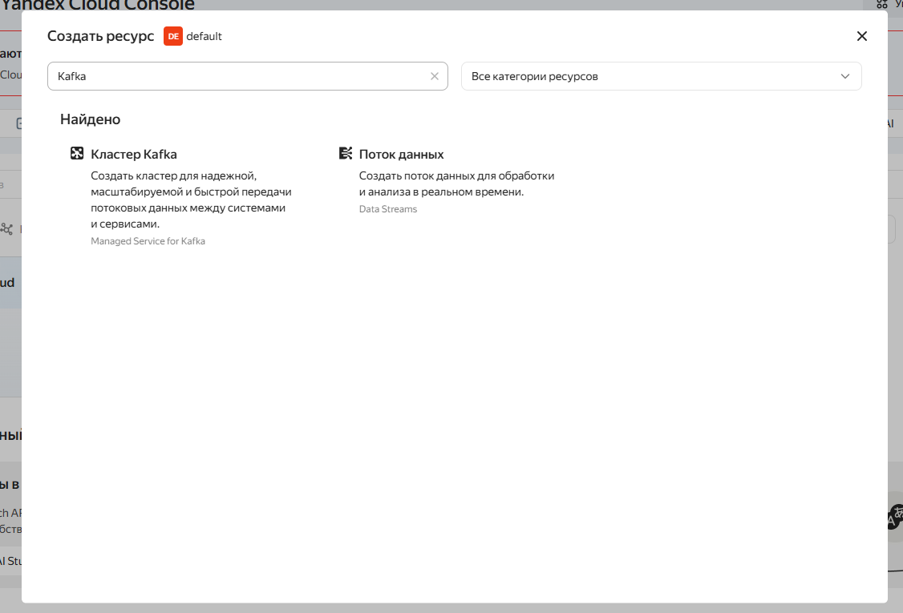
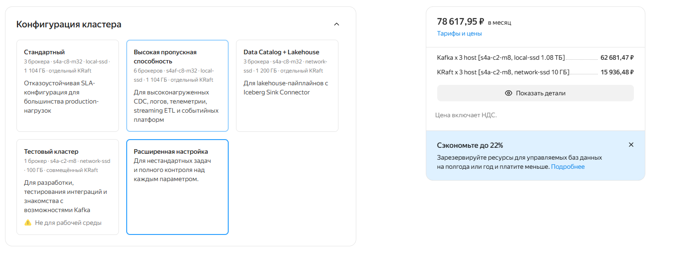
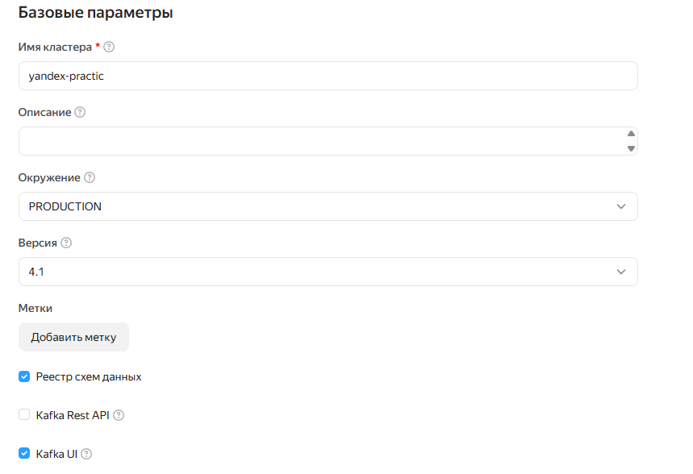
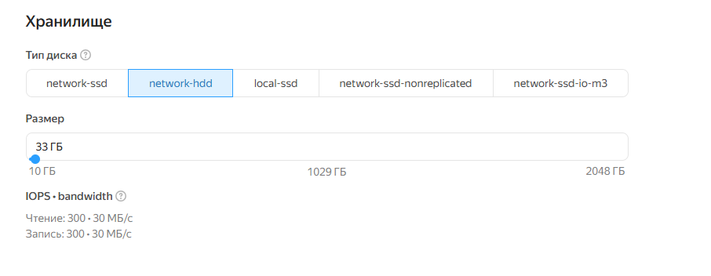
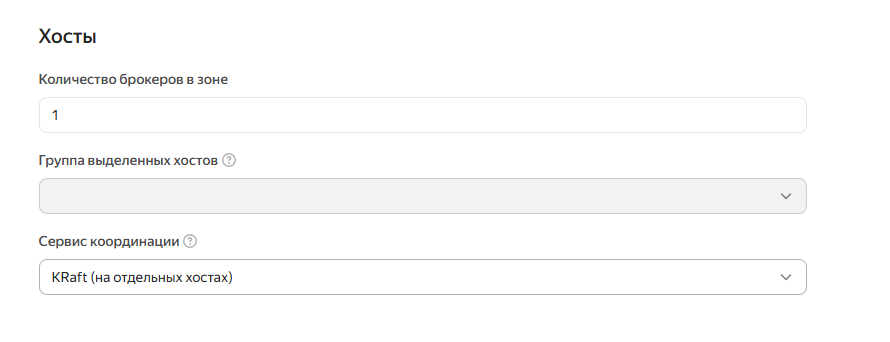
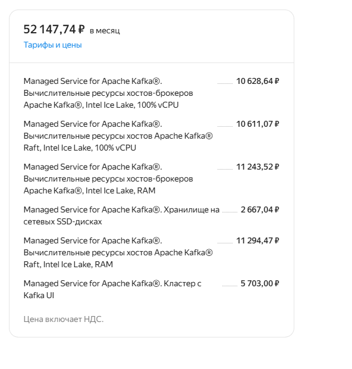

# Развертывание кластера Kafka в Yandex Cloud

## Шаг первый, создать ресурс кластера

В интерфейсе Яндекс Клауд консоли создать кластер Kafka

## Шаг второй, выбор конфигурации кластера и подключаемых параметров

Для выполнения задания выберем тестовую конфигурацию кластера с 3 брокерами

Сделаем настройки оптимизированными, чтобы не сильно нагрузить бюджет облачного провайдера

Выберем сервис с Schema Registry и Kafka-UI

Учитывая нашу тестовую инфраструктуру нет необходимости брать SSD с очень большим диском, для практики подойдет HDD на ~33 гб

KRaft настройки выполним такие:

## Шаг третий. Финальный подсчет

После всей оптимизации сумма кластера для практики выходит:

KRaft запущен в комбинированном режиме. 

### Примечание

Ресурсы создаются в Казахстане, в связи с недоступностью сервиса Kafka в RU-сегменте Yandex Cloud.

