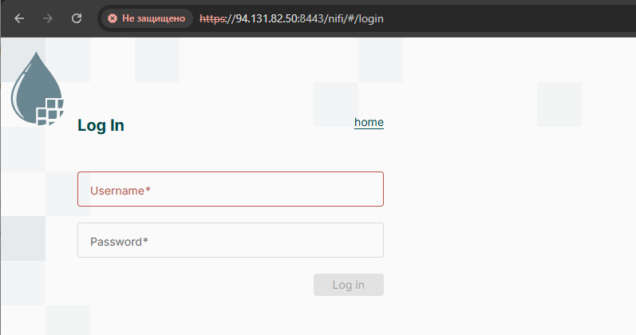
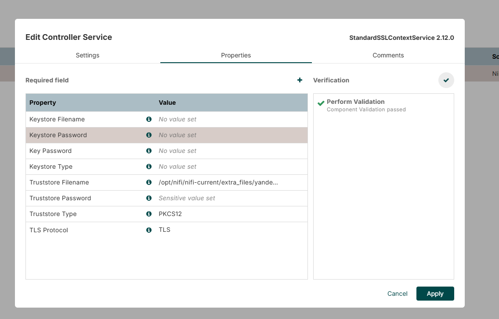
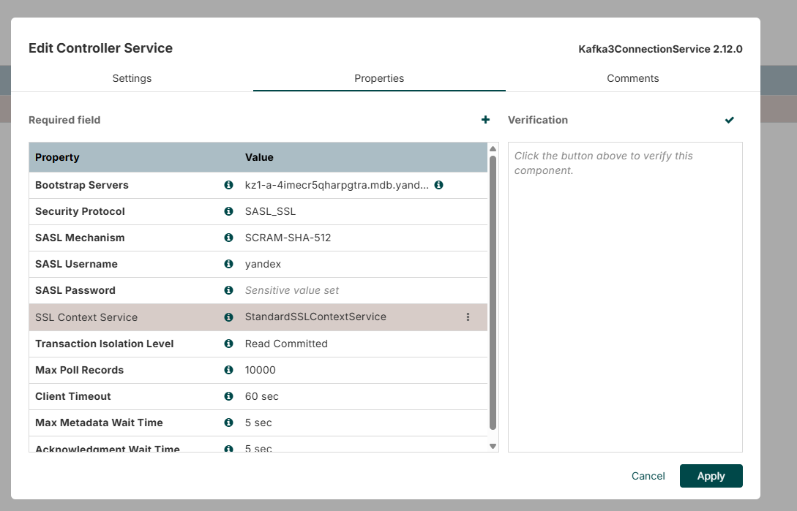
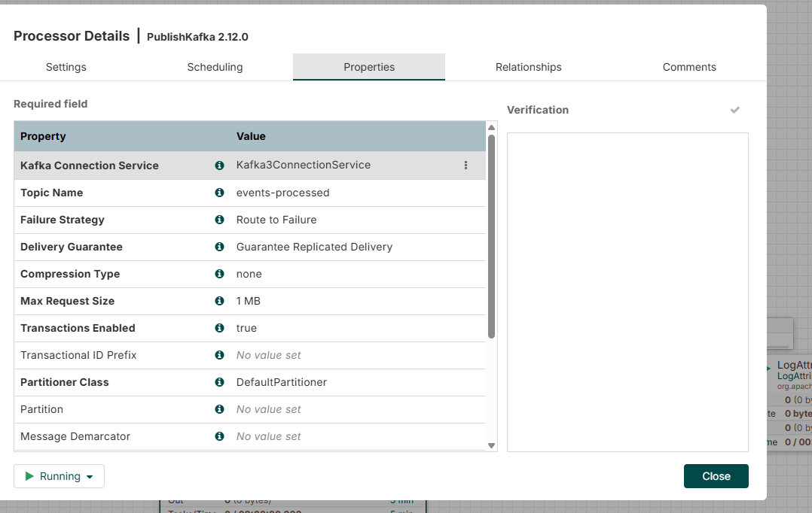
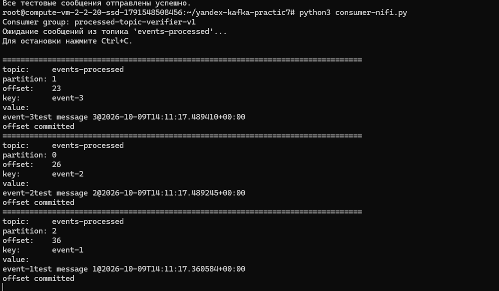

# Apache NiFi

## Шаг первый, развернуть в инфраструктуре YC KZ




### Как был запущен Apache NiFi? 


```yaml
services:
  nifi:
    image: apache/nifi:2.12.0
    container_name: nifi-kafka
    restart: unless-stopped

    ports:
      - "8443:8443"

    environment:
      NIFI_WEB_HTTPS_HOST: "0.0.0.0"
      NIFI_WEB_HTTPS_PORT: "8443"
      NIFI_WEB_PROXY_HOST: "${NIFI_PUBLIC_IP}:8443"

      AUTH: "single-user"
      SINGLE_USER_CREDENTIALS_USERNAME: "${NIFI_ADMIN_USERNAME}"
      SINGLE_USER_CREDENTIALS_PASSWORD: "${NIFI_ADMIN_PASSWORD}"

      KEYSTORE_PATH: "/opt/nifi/certs/keystore.p12"
      KEYSTORE_TYPE: "PKCS12"
      KEYSTORE_PASSWORD: "${KEYSTORE_PASSWORD}"

      TRUSTSTORE_PATH: "/opt/nifi/certs/truststore.p12"
      TRUSTSTORE_TYPE: "PKCS12"
      TRUSTSTORE_PASSWORD: "${TRUSTSTORE_PASSWORD}"

    volumes:
      - ./certs:/opt/nifi/certs:ro
      - ./data:/opt/nifi/nifi-current/extra_files:ro
      - nifi_data:/opt/nifi/nifi-current/data
      - nifi_logs:/opt/nifi/nifi-current/logs

volumes:
  nifi_data:
  nifi_logs:
```

```bash
root@compute-vm-2-2-20-ssd-1791548508456:~/nifi-kafka# docker compose ps
NAME         IMAGE                COMMAND                 SERVICE   CREATED         STATUS         PORTS
nifi-kafka   apache/nifi:2.12.0   "../scripts/start.sh"   nifi      4 minutes ago   Up 4 minutes   8000/tcp, 10000/tcp, 0.0.0.0:8443->8443/tcp, [::]:8443->8443/tcp
```

Создание SSL Controller



## Конфигурация ApacheKafka Consumer в NiFi



## Конфигурация PublishKafka в NiFi в events-processed




## Что-то попало




